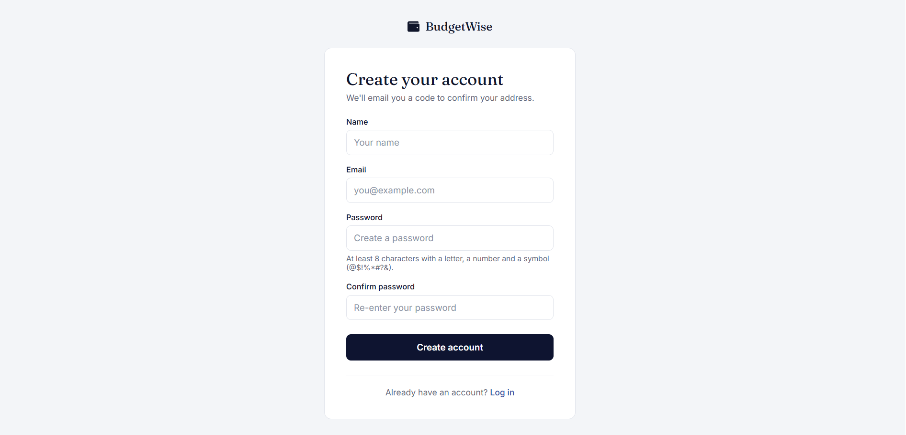
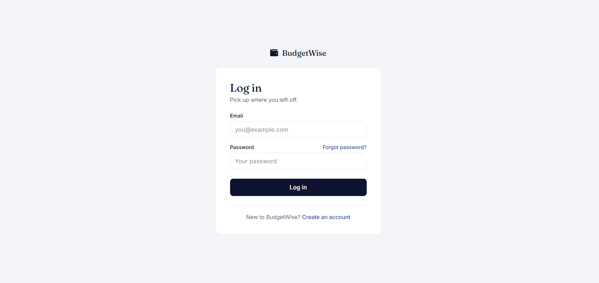
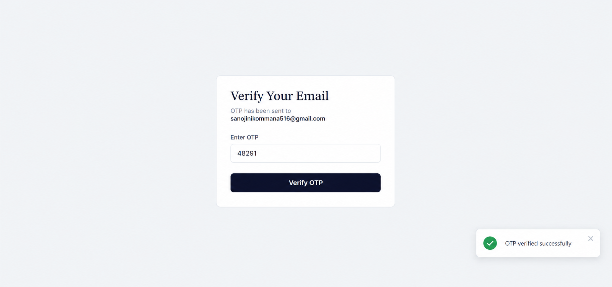
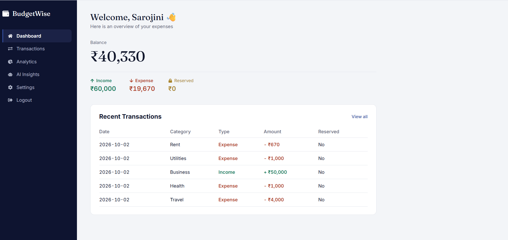
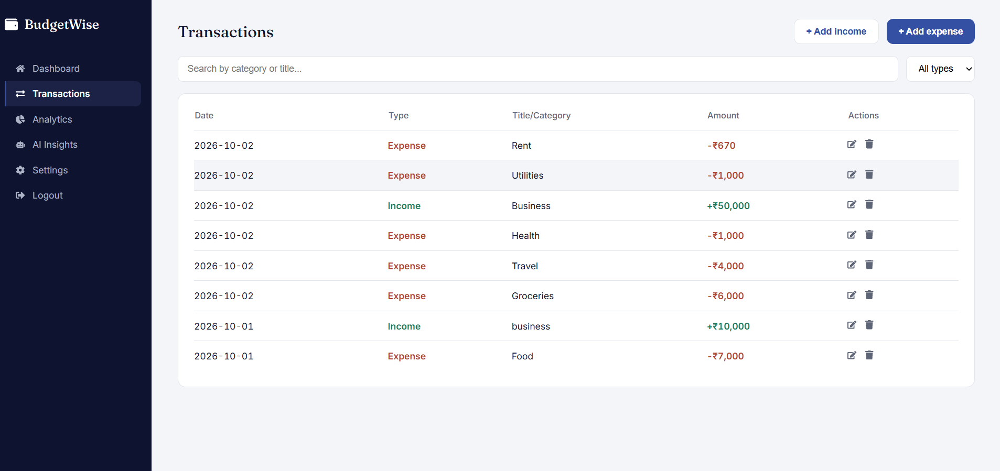
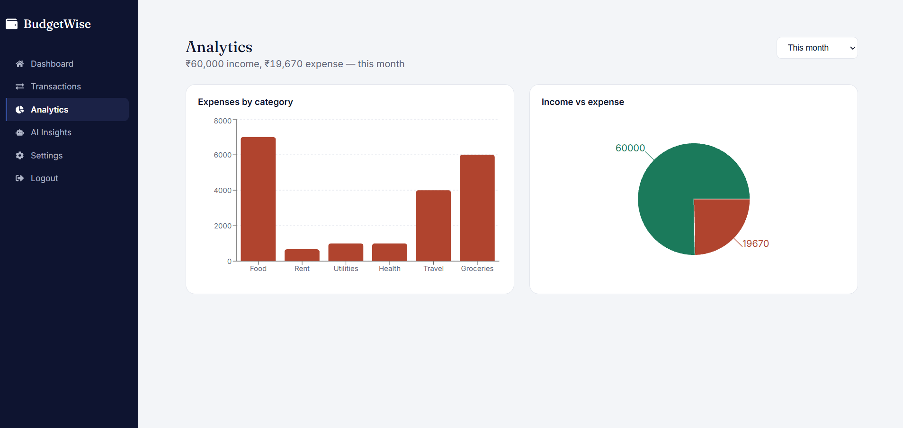
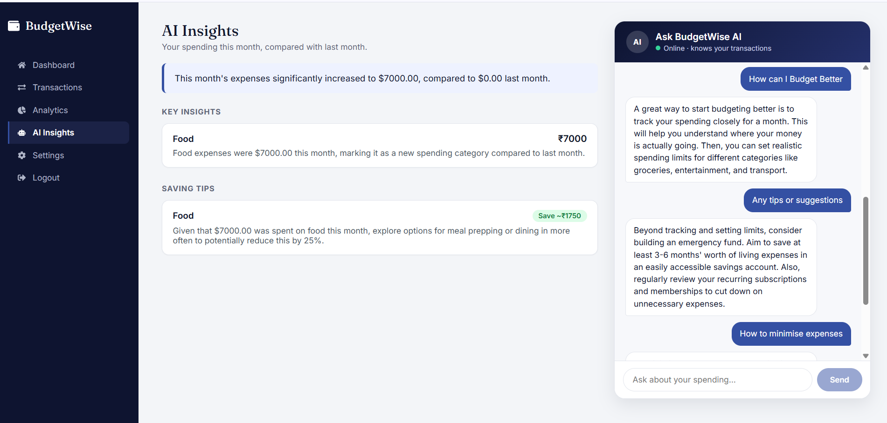
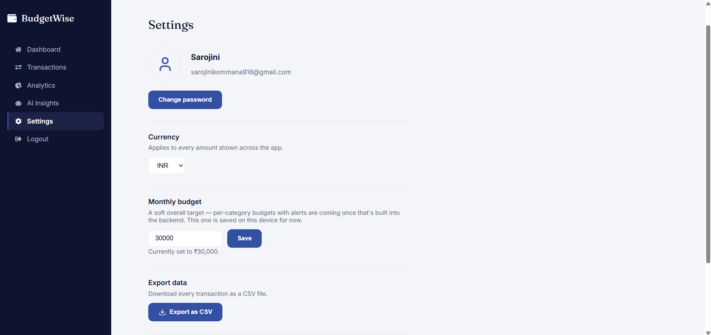

# BudgetWise

A full-stack personal finance tracker with AI-powered insights. Built with
React (Vite) on the frontend and Spring Boot + MySQL on the backend, with
Google Gemini powering a monthly insights summary and an in-app chat
assistant that can answer questions about your own transaction history.

## Features

- **Authentication with OTP verification** — email-based OTP on registration
  and password reset, on top of BCrypt-hashed passwords.
- **Dashboard** — a balance-first overview (available balance, income,
  expenses, reserved funds) plus a recent-transactions list.
- **Transactions** — add, edit, and delete income/expense entries, with
  search, type filtering, and pagination.
- **Analytics** — category and income-vs-expense breakdowns, filterable by
  time period (this month / last month / last 3 months / all time).
- **AI Insights & Chat** — Gemini-powered monthly spending insights, and a
  chat assistant with function-calling that queries the signed-in user's own
  transaction data to answer natural-language questions (e.g. "how much did
  I spend on food last month?"). The backend scopes every tool call to the
  authenticated user, so the model can only ever see that user's data.
- **Settings** — currency selection (applies across the whole app), a
  monthly budget target, and CSV export of all transactions.

## Tech stack

| Layer      | Technology |
|------------|------------|
| Frontend   | React, Vite, React Router, Recharts, Lucide / React Icons |
| Backend    | Spring Boot, Spring Security, Spring Data JPA |
| Database   | MySQL |
| AI         | Google Gemini API (insights generation + function-calling chat) |
| Auth       | BCrypt password hashing, email OTP via Spring Mail |

## Architecture

```
┌──────────────┐      REST (JSON)      ┌──────────────┐      JDBC      ┌───────────┐
│ React + Vite │ ───────────────────▶ │ Spring Boot  │ ─────────────▶ │  MySQL    │
│  (frontend)  │ ◀─────────────────── │  (backend)   │ ◀───────────── │           │
└──────────────┘                       └──────┬───────┘                └───────────┘
                                               │
                                               ▼
                                        ┌──────────────┐
                                        │  Gemini API  │
                                        │ (insights &  │
                                        │ chat tools)  │
                                        └──────────────┘
```

## Screenshots

**Home page**


**Sign up**


**Login**


**OTP verification**


**Dashboard**


**Transactions**


**Analytics**


**AI Insights & Chat**


**Settings**


## Getting started

### Prerequisites

- Node.js 18+
- Java 21
- MySQL running locally
- A Google Gemini API key ([ai.google.dev](https://ai.google.dev))
- A Gmail account with an [app password](https://support.google.com/accounts/answer/185833) (for sending OTP emails)

### Backend

```bash
cd backend
```

Create `src/main/resources/application.properties` with:

```properties
spring.application.name=budgetwise
server.port=8080

# MySQL connection
spring.datasource.url=jdbc:mysql://localhost:3306/budgetwise
spring.datasource.username=YOUR_MYSQL_USERNAME
spring.datasource.password=YOUR_MYSQL_PASSWORD
spring.datasource.driver-class-name=com.mysql.cj.jdbc.Driver

# JPA
spring.jpa.hibernate.ddl-auto=update
spring.jpa.show-sql=true
spring.jpa.database-platform=org.hibernate.dialect.MySQLDialect

# Email (for OTP)
spring.mail.host=smtp.gmail.com
spring.mail.port=587
spring.mail.username=YOUR_GMAIL_ADDRESS
spring.mail.password=YOUR_GMAIL_APP_PASSWORD
spring.mail.properties.mail.smtp.auth=true
spring.mail.properties.mail.smtp.starttls.enable=true

spring.main.allow-bean-definition-overriding=true
gemini.api.key=YOUR_GEMINI_API_KEY
```

Then run:

```bash
./mvnw spring-boot:run
```

The API starts on `http://localhost:8080`.

### Frontend

```bash
cd budgetwise_frontend
npm install
npm run dev
```

The app runs on `http://localhost:5173`.

