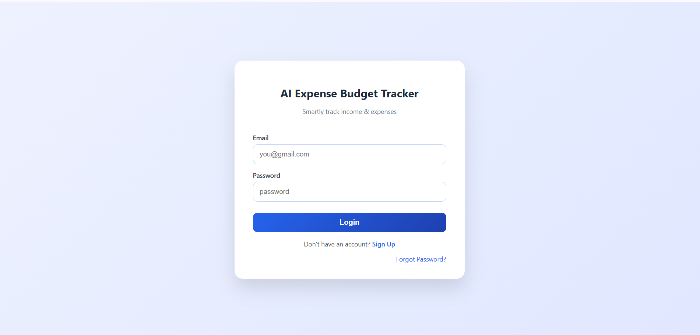
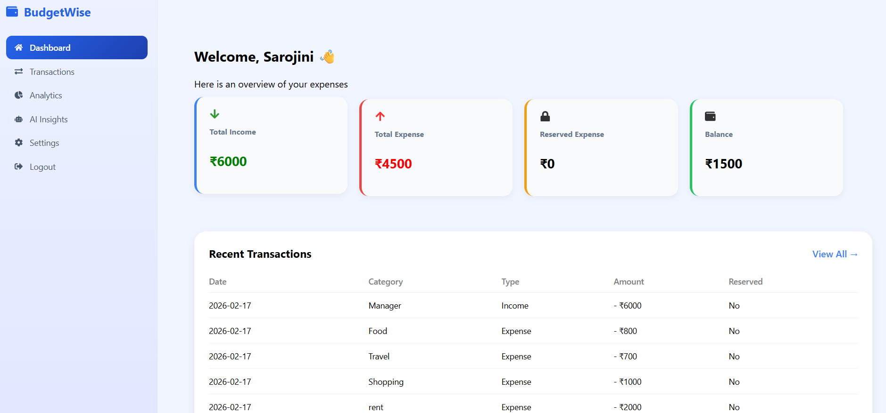
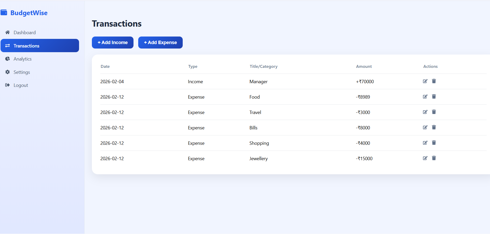
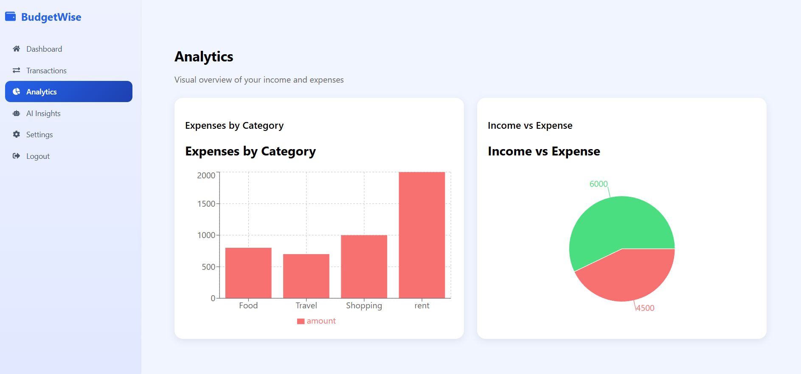
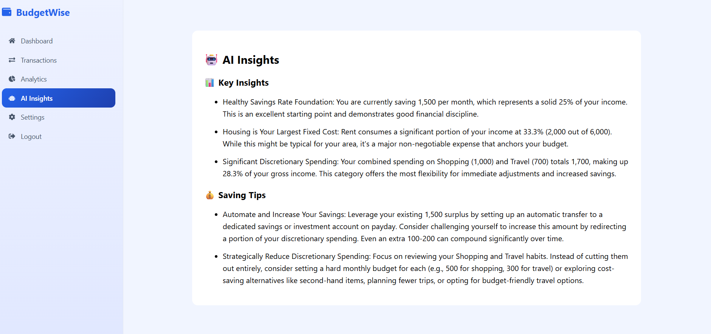
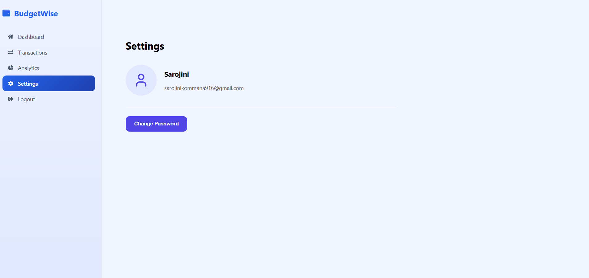

# 💰 BudgetWise

A modern, fully responsive **Personal Finance Management Web Application** that helps users track income, expenses, and visualize financial data efficiently.

Built using **React.js**, **Spring Boot**, and **MySQL**, BudgetWise provides secure authentication, insightful analytics, and an intuitive dashboard.

---

## ✨ Features

### 📊 Dashboard Overview
- 💵 Total Income  
- 💸 Total Expenses  
- 🏦 Reserved Amount  
- 📈 Available Balance  
- 🕒 Displays last 5 transactions  

---

### 💰 Transaction Management
- ➕ Add income & expense transactions  
- ✏️ Edit existing transactions  
- 🗑 Delete transactions  
- 📋 View full transaction history  

---

### 📈 Analytics & Insights
- 📊 Bar chart for **Category vs Expenses**  
- 🥧 Pie chart for **Income vs Expenses**  
- Real-time financial visualization  

---

### 🔒 User Authentication
- 📝 Registration with OTP verification  
- 🔑 Login with Email & Password  
- 🔄 Forgot Password with OTP verification  

---

### ⚙️ Settings & Profile
- 👤 View user profile  
- 🔐 Change password  
- 🚪 Logout securely  

---

## 🎨 UI & Navigation

- 📱 Fully responsive design  
- 🌗 Light/Dark mode support  
- 🧭 Sidebar navigation  
- 🔝 Top navigation bar  

---

## 🛠 Technology Stack

| Layer | Technology | Usage |
|---------|-------------|------------|
| 🎨 Frontend | React.js | Single Page Application |
| ⚙️ Backend | Spring Boot (Java) | REST API Development |
| 🗄 Database | MySQL | Persistent Data Storage |
| 📊 Charts | Recharts | Bar & Pie charts |
| 💅 Styling | CSS / Tailwind CSS | UI Design |

---

## 🏗 System Architecture

React Frontend  →  Spring Boot REST API  →  MySQL Database


---

## 🚀 Getting Started

### 📌 Prerequisites
- Node.js  
- Java 17+  
- MySQL  
- Maven  

---

### ▶️ Frontend Setup

```bash
cd frontend
npm install
npm start
```

---

### ▶️ Backend Setup

```bash
cd backend
mvn spring-boot:run
```

---

### 🗄 Database Setup
1. Create MySQL database  
2. Update credentials in `application.properties`  

---

## 📷 Screenshots
## 📸 Screenshots

### 🏠 Landing Page


### 🔐 Login Page


### 📊 Dashboard


### 💰 Transactions


### 📈 Analytics


### 🤖 AI Insights


### ⚙️ Settings Page



---


